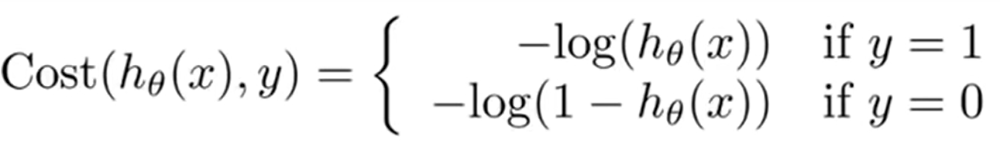
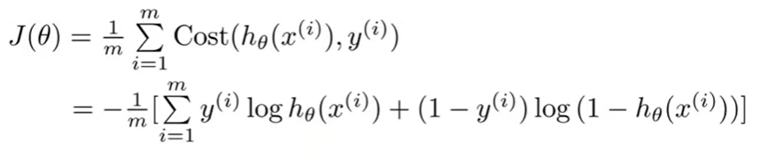
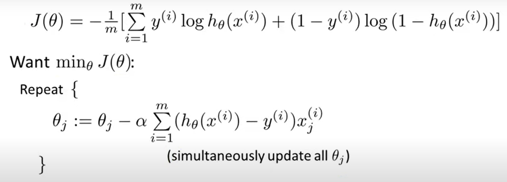

# Logistic Regression
## Resources Used
## Algorithm
### Hyphotesis Function
m = number of samples, n = number of features, x = training samples in a shape of (n,m), θ = weights in a shape of (n,1)  
sigmoid(x) = 1 / (1 + e-x)  
hθ(x) = sigmoid(θTx) => 1 / (1 + e-θTx)  
### Cost Function (Maximum Likelyhood)

We can analyze this cost function on 2 different states.
#### If the Actual Class Equals to 1
If the actual class equals to 1 then our cost function equals to -log(hθ(x)). If we look at the graph of -log(hθ(x)), we can infer that while the h(x) goes to 0, cost function converges to &infin;. This means we penalize the algorithm if it predicts as 0 when the actual class is 1, by adding huge numbers to the cost function.
)")
#### If the Actual Class Equals to 0
If the actual class equals to 0 then our cost function equals to -log(1 - hθ(x)). If we look at the graph of -log(1 - hθ(x)), we can infer that while the h(x) goes to 1, cost function converges to &infin;. This means we penalize the algorithm if it predicts as 1 when the actual class is 0, by adding huge numbers to the cost function.
)")
#### Combine it into 1 function

Nothing changes, we just combine the functions into 1. If y=1 cost function equals to -log(hθ(x)), else cost function equals to  -log(1 - hθ(x)).
### Gradient Descend

Update rule for gradient descend is identical with the linear regression. One thing differ and it is the definiont of the hypothesis. For the linear regression, it is θTx, for the logistic regression it is 1 / (1 + e-θTx).
### Regularization
