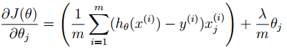

# Logistic Regression
## Resources Used
https://www.youtube.com/watch?v=t1IT5hZfS48
https://www.youtube.com/watch?v=TTdcc21Ko9A
https://www.youtube.com/watch?v=IXPgm1e0IOo
## Algorithm
### Hyphotesis Function
m = number of samples, n = number of features, x = training samples in a shape of (n,m), θ = weights in a shape of (n,1)  
sigmoid(x) = 1 / (1 + e-x)  
hθ(x) = sigmoid(θTx) => 1 / (1 + e-θTx)  
### Cost Function (Maximum Likelyhood)

We can analyze this cost function on 2 different states.
#### If the Actual Class Equals to 1
If the actual class equals to 1 then our cost function equals to -log(hθ(x)). If we look at the graph of -log(hθ(x)), we can infer that while the h(x) goes to 0, cost function converges to &infin;. This means we penalize the algorithm if it predicts as 0 when the actual class is 1, by adding huge numbers to the cost function.  
)") 
#### If the Actual Class Equals to 0
If the actual class equals to 0 then our cost function equals to -log(1 - hθ(x)). If we look at the graph of -log(1 - hθ(x)), we can infer that while the h(x) goes to 1, cost function converges to &infin;. This means we penalize the algorithm if it predicts as 1 when the actual class is 0, by adding huge numbers to the cost function.  
)") 
#### Combine it into 1 function
   
Nothing changes, we just combine the functions into 1. If y=1 cost function equals to -log(hθ(x)), else cost function equals to  -log(1 - hθ(x)).
### Gradient Descend
  
Update rule for gradient descend is identical with the linear regression. One thing differs and it is the definition of the hypothesis. For the linear regression, it is θTx, for the logistic regression it is 1 / (1 + e-θTx).
### Regularization
In order to overcome the overfitting problem, we can use regularization technique by adding extra term to the cost function. Here &Lambda; is a new parameter that we can control to adjust the regularization effect.  
  
Now with the new added term we force the learning algorithm's parameter to be smaller. For example, if we say that &Lambda;=100, now the only way that we can minimize the cost function is that learning algorithm parameters should be very small. Smaller the parameter we get smoother functions, and we can avoid overfitting. &Lambda; should be picked very carefully, bigger values of &Lambda; makes learning algorithm to underfit, and samller values of &Lambda; makes learning algorithm to overfit.
#### Regularized Gradient Descend

