# Support Vector Machine
## Resources
## Algorithm
Basically, support vector machine aims to seperate the data with the hyperplanes by maximazing the mariginal distance. 
This mariginal distance is defined as the nearest observations to the hyperplane. Also, this observations are called as support vectors. Formula of the
hyperplane is as following:  
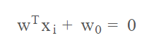  
### Mathematical Derivation of Optimization Function
In order to classify an obervation, we require the following inequalities with an additional error term that gives more flexibility for our model. That transforms
our algorithm from large marigin classifier to soft marigin classfier. In the later stpes this will be more clear.  
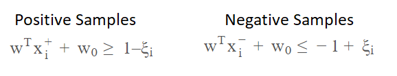  
If we introduce a new variable called ti as 1 if an observation is postive; -1 otherwise, we can combine positive and negative classification 
formula into 1 single formula.  
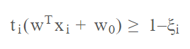  
* If error term equals to 0, then sample is correctly classified and outside the marigin.
* If error is between the 0 and 1, then sample is correctly classfied and it is inside the marigin.
* If error is greater than 1, then it is missclassified.  
Therefore, we can define an error term as follows.  
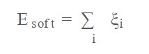  
We want to maximize the marigin by minimizing the norm of the weight. Also, we wanto to minimize the soft marigin error. Therefore, we can define optimization
objective as follows, with the some constant regularization term C in front of the soft error.  
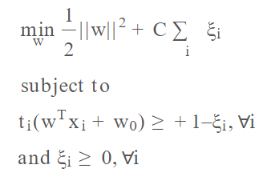  
Functions on given constraints can be optimized via the method of Lagrange Multipliers.
#### Method of Lagrange Multipliers
If the optimization function is rewritten as Lagrange Method required, we get the new following formula.  
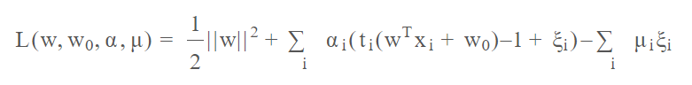  
After that, if we take the derivatives in terms of all the 4 parameters and set them to 0, we get the following:  
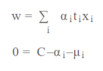  
If we substitute the above on the lagrange function, finally we get the following optimization function. It is important to note that final optimization function only depends on the dot products of pairs of samples. This makes support vector machines so powerful, because we can use transformations on the observations so effectively.  
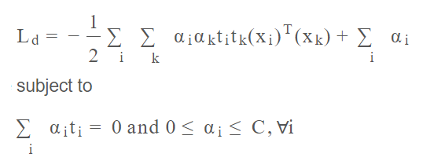  
### Linearly Seperable Data
By optimazing the above function, a linearly seperable data can be seperated as bellow. 
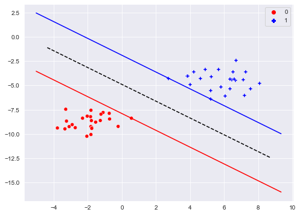  
Important to note that SVM maximizes the marigin while seperating the dataset. What happens if we add an outlier to the same dataset?
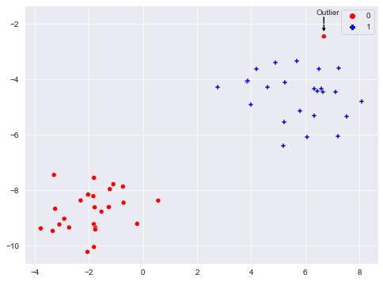  
We can investigate it by fine tuning the parameter C.
### Effect of Parameter C
As it was mentioned earlier, parameter C defines the if the svm acts like hard marigin classifier or soft marigin classifier. Unlike soft marigin, hard marigin has no tolerate on the missclasifications. If we give a huge value to C svm will act as hard marigin, because in order to minimize the loss function algorithm prioritizes the minimization of error term. This led to error term to be equal to zero. On the other hand, if a small values is assigned to C then algorithm can tolerate reasonable amount of missclassifications. Below figures explains this situation visually.
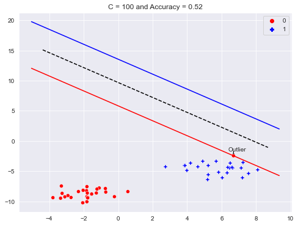
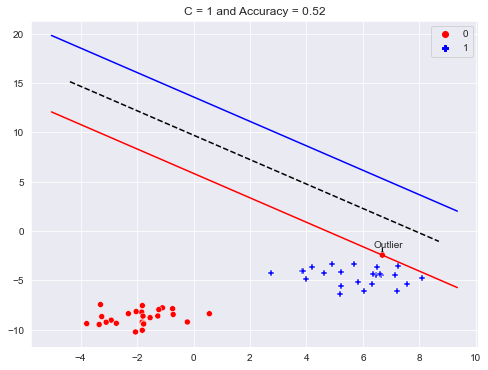
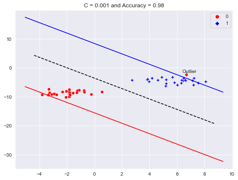
### Not Linearly Seperable Data & Usage of Kernels
### Effect of Gaussian Kernel Parameters
