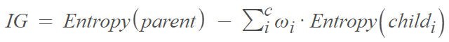
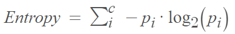
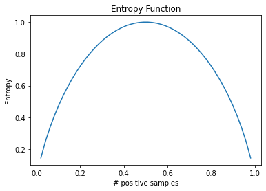
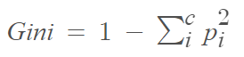
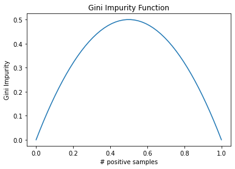
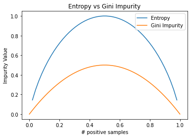

# Decision Tree
## Resources
https://www.youtube.com/watch?v=jVh5NA9ERDA (Decision Tree Theory)
https://www.youtube.com/watch?v=Bqi7EFFvNOg (Implementation from Scratch)
https://www.youtube.com/watch?v=5aIFgrrTqOw (Entropy vs Gini Impurity)
## Algorithm
Decision tree is a binary tree that recursively splits the data by the choosen best feature and threshold value. The key concept of the decision trees is the selection  
of the split. There are many options on how to create a decison tree based on a given dataset. The best split is found by information gain technique.
### Information Gain
Information gain is calculated based on the entropy of the child nodes as follows:
  
where wi = weighted average of the child node and c = number of child nodes.
#### Entropy
Entropy is the measure of disorder on a given node. Entropy can be calculated as follows:
  
where c is the number of distinct class on a given node. We can observe the entropy function on the below graph for a binary classification problem.
  
From this graph we can infer that when a distribution gets purer, entrpoy gets smaller. Entropy gets the highest value 1 when the number of positive and negative samples
are equal. 
#### Gini Impurity
Gini impurity is an alternative method to calculate entropy. It can be calculated as follows:
  
We can observe the gini impurity function on the below graph.
  
The only difference between the entropy and gini impurity is that the highest value of the gini impurity is 0.5. It is very important to note that gini impurity is 
computationally more efficent compared to entropy, because entropy formula involves logarithmic calculation. 
  
