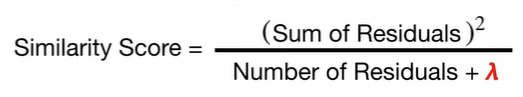
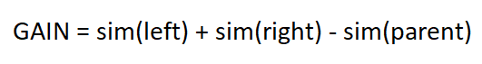
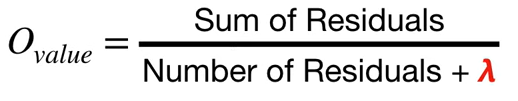
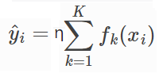

# XGBoost Regressor
XGBoost is another boosting technique used for both regression and classification problems. It is more flexible algorithm compared to Gradient Boosting, since it adds
regularization term to the training process.

## Difference Between Bagging and Boosting

The difference between the random forest which is a bagging technique, is how it is trained.
In boosting, we start with a simple base model and collection of weak learners are trained to get one final model. Each weak model learns from the errors of the previous
weak learners. This means each weak model depends on the previous ones. Boosting aims to reduce high bias. Whearas in bagging, multiple independent trees are trained on
bootstraped(with replacement) samples and then combined to make a prediction. Bagging aims to reduce the high variance.

## Difference Between Traditional Decision Trees and XGBoost Tree

There are some minor differences between the traditional trees and xgboost trees. For the traditional decision tree regressor, while spliting the tree into branches
information gains are calculated based on the reduction of the variance. It is aimed to maximize the reduction of variance with each split. Wheras in xgboost trees, this
is calculated based on the similarity scores. A similarity score can be calculated for a single node as follows:

 

where &lambda is regularization parameter. Overall gain from the parent node can be calculated as follows:

Also, there is &gamma parameter. If gain is smaller than this &gamma threshold, we prune that branch. &lambda and &gamma hyperparameters can be used to control the overfitting.
If &lambda is a big value, than the similarity scores becomes smaller and there is a higher chance to gain being smaller than the &gamma value. Also, it is same for the 
&gamma, higher the &gamma there is higher chance to gain being smaller than the &gamma value. The prediction output for a single leaf is as below:

The overall prediction for the XGBoost regressor is as following:

where &eta is learning rate, K is the number of trees, and fk(xi).

The mathematical derivations of the formulas can be studied further by following these great sources down below. 

## Resources Used
- https://xgboost.readthedocs.io/en/stable/tutorials/model.html
- https://www.youtube.com/watch?v=OtD8wVaFm6E
- https://www.youtube.com/watch?v=ZVFeW798-2I
