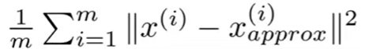
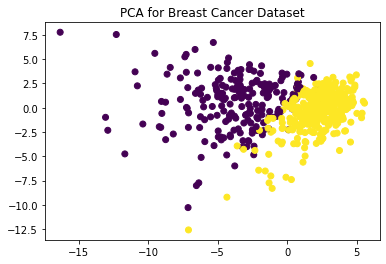

# Principal Component Analysis
Principal component analysis is a dimensionality reduction technique. It can achieve this by identifying the most important features from the dataset. It maps the original
dataset into the new coordinate system that is composed of multiple principal components. The principal components are linearly independent and orthogonal with each 
other. The first principal component explains the large amount of variation in the variables, and the other components explains the remaining variance. 

## Motivation to use PCA
There may be various reasons to use PCA:

- <b> Data Compression: </b> We can save significant amount of space by storing the reduced version of the data by using PCA.
- <b> Machine Learning: </b> If we dataset with huge number of features, we can use PCA to decrease the feature size and eliminate redundancy in the data. Also, this makes
machine learning algorithm to train more quickly.
- <b> Data Visualization: </b> We can use PCA while performin exploratory data analysis. We can apply PCA to high dimensional data and reduce it to 2D or 3D, so that it 
becomes easier to visualize.

## Algorithm
The basic idea behind the PCA is that it tries to minimize the average squared projection error. The projection error is the sum of orthogonal distances to the principal component for each observation. The squared projection error is as below:

It is important to apply mean normalization and feature scaling before applying PCA, since different scales of variables can dominate the projection error. Although mathematical derivation of the PCA is complex, the below steps can be followed:

- Scale the features
- Calculate the covariance matrix: &Sigma; = $\X^T * X / m$
- Calculate eigen vectors of &Sigma; by singular value decomposition: U,S,V = SVD(&Sigma;)
- Get the k principal components U_{reduced} = U[:k]
- Calculate the transformed data: Z = $\U_{reduced}^T * X$

A simple PCA result of breast cancer dataset is as below. Dimension is reduced from 30 to 2.

## Resources
https://www.youtube.com/playlist?list=PLl9TabrCI60Oa5hSWnYmaMuBexbUO95Ps (PCA)
https://www.analyticsvidhya.com/blog/2021/09/pca-and-its-underlying-mathematical-principles/
